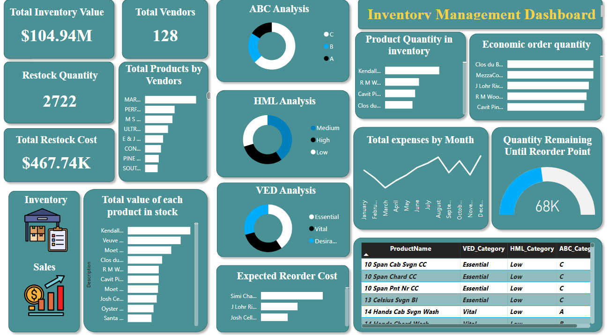
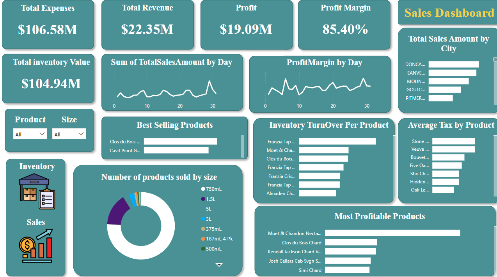
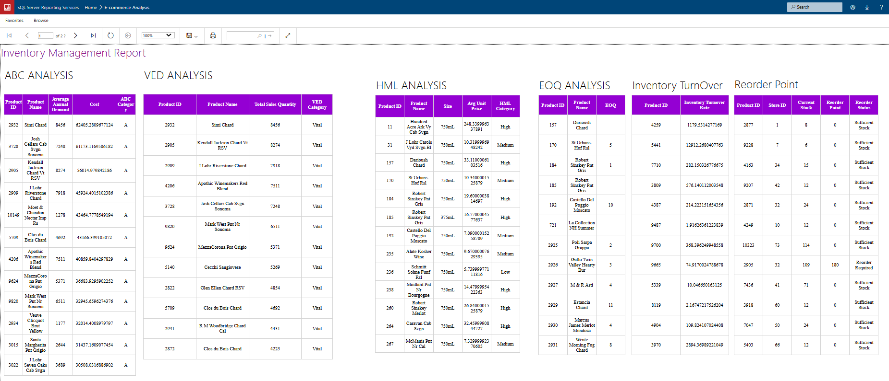
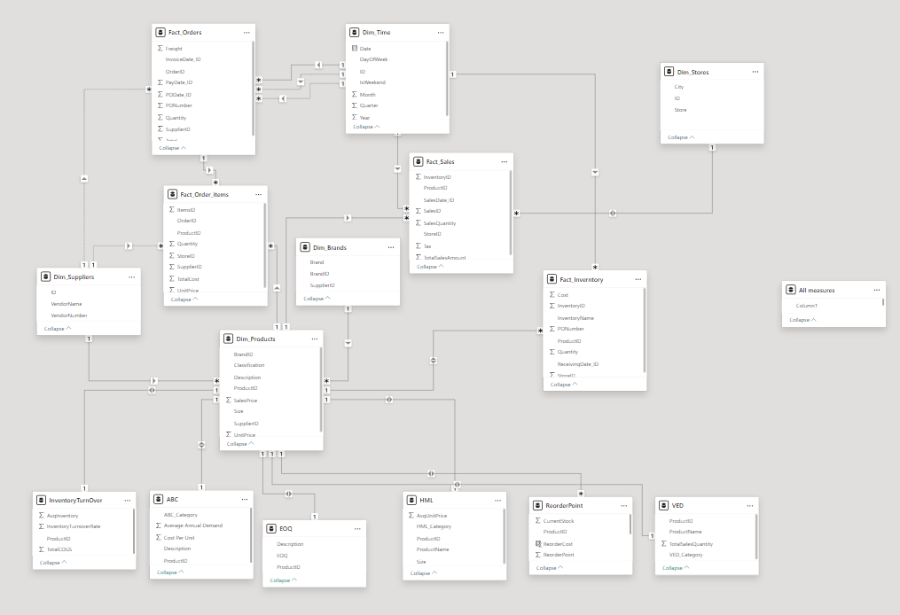

# E-commerce Sales and Inventory Management Dashboard

This project provides e-commerce businesses with actionable insights into sales and inventory management using Power BI and SSRS.

## Key Features

- **Inventory Analysis**: ABC, VED, and HML categorizations for strategic inventory planning.
- **Reorder Optimization**: EOQ and reorder point calculations to maintain efficient stock levels.
- **SSRS Reporting**: Additional inventory insights through comprehensive reports.

## Project Structure

- **`data/`**: Dataset files used for analysis.
- **`scripts/`**: SQL scripts for data transformation and cleaning.
- **`business requirements/`**: Project objectives and business requirements.
- **`dashboard and report/`**: Power BI dashboard and SSRS report files.
- **`images/`**: Contains images of the dashboard, report, and data model.
- **`videos/`**: Video demonstration of the project.

### Dashboard and Reports
#### Inventory Dashboard

#### Sales Dashboard

#### SSRS Report

### Data Model

### Project Demo

https://github.com/user-attachments/assets/b535c954-601c-4c95-8c7e-e47cf593a079

## Setup and Usage

1. Clone the repository.
2. Execute SQL scripts from `scripts/` in SQL Server.
3. Open `dashboard_and_report/E-Commerce Dashboard.pbix` in Power BI, connect to the data source.
4. Review SSRS reports for additional insights.

## License

This project is licensed under the MIT License - see the [LICENSE](LICENSE) file for details.
